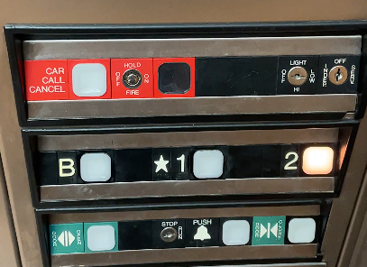

### **Chris Brandt – Project 1**

Please use GitHub Pages to see webpage.

# **C**

Current layout:

Issues with the current design:

Above-Board: While the current layout of the control panel is decent, the display for the floor level is located far above the control panel—and it wasn't working. There still are issues with the control panel design, but overall, it is within the bare minimum.

As for the design of the control panel…

- Simple layout of three rows which contain the following types of buttons: emergency, floor level, and special function buttons.
- All buttons light up when pressed.
- The floor level buttons are logically placed and easily identifiable.
- The emergency button directions are unclear.
  - What button should be pressed during an emergency?
- The special function buttons are muddled with operator keyholes and label positioning.
- Has no braille text or other accessibility features.

# **B**

Common use case:

As I am neither an elevator technician nor plan to become one, this interface is acceptable for my own use. I use elevators to travel between different floors of buildings, typically to transport heavy or bulky objects more easily and safely.

User use case:

1. A user will call the elevator to their floor by pressing a button on the floor's control panel.
2. The user will enter the elevator when it arrives.
3. The user will find the button for the floor they wish to travel to on the elevator's interface.
4. The elevator will close its doors, transport the user to the corresponding floor, and will open its doors when it arrives.

How does the elevator support the user and provide feedback?

- The elevator buttons are placed in a logical layout, each button has a label to the left of it, and the buttons light up when they are pressed.

What are some common mistakes?

- Overcomplicating the layout. As there are not many floors—and there is only one elevator door—the elevator does not need many features.

Improved design:

Design improvements:

- Change the layout from "horizontal" to "vertical".
- Separate operator/technician functions to its own section.
- Provide clearer instructions for the emergency buttons.
- Provide additional accessibility options, like braille.

# **A**

The screen size will be 6x4 inches.

